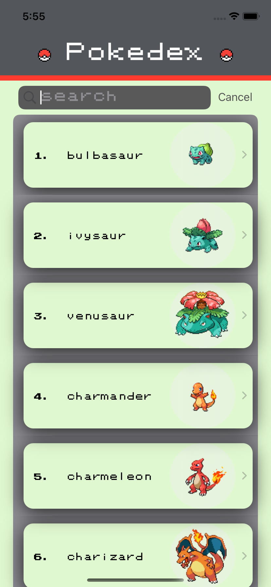
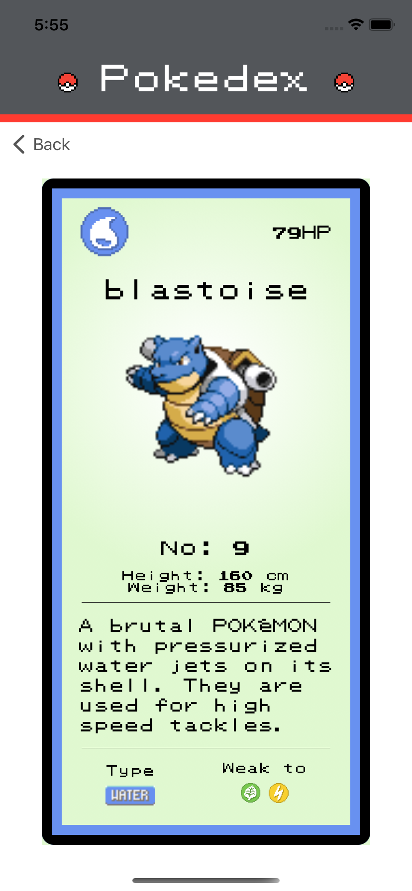
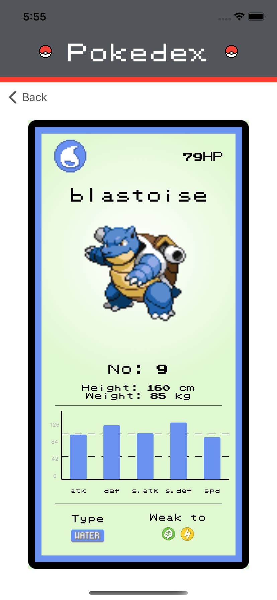
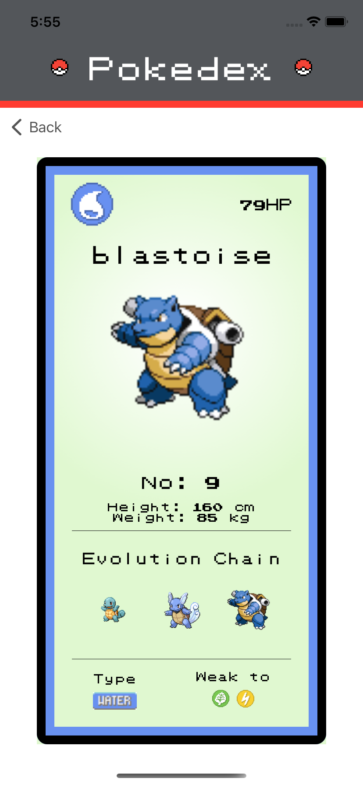

<h1 align="center">

Pokédex

</h1>

## Objective
Create a Pokédex of all 151 original pokémon, utilising the Pokémon API (https://pokeapi.co/). Results are displayed in a list, with navigation to a bio of each Pokémon.

## Progress
- Splash Screen complete
- Animation added for bouncing pokeballs in Header
- List of pokemon now displayed in main pokedex screen 
- App logo added
- Detailed Pokemon View added
- Detail Pokemon Card Border now changes depending on pokemon type
- PrettyAxis installed
- Pokemon Stats now displayed under Bio
- Pokemon Evolution now displayed in Pokemon Bio
- Legendary Pokemon indicated
- Added Screenshots

## Improvements
- Image caching
- Fully mocked network requests

## Testing
- 5/5 UI Tests passing
- 1/2 Network Unit Tests passing

## Installation

1. Clone repository

## Screenshots

## Demo

## Tech Stack
SwiftUI

## Simulator version
11

## Dependencies
- PrettyAxis
- Nuke
